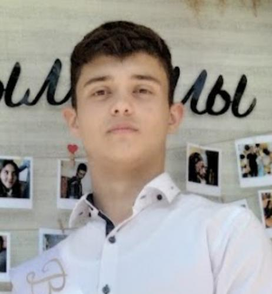

# Hi there 👋  

I'm Nick, and I am glad to see you at my GitHub profile!  

Here you can find some interesting projects on Python, Java, and JavaScript.  

So, don't waste time and check it out!  

## ?Photo?

  

## About Me  

I'm a student at USM (The State University of Moldova), Faculty of "Mathematics and Informatics", specializing in "Applied Informatics".  

What about my work experience? Unfortunately, I don't have much...  
My previous position was **Project Manager** in an IT company.  
It was my first experience in IT, so I consider it to have been quite valuable.  

## Hobbies & Interests  

My general interests are **sports, literature, and... programming**.  
I think it's great when your profession matches your hobbies, and you enjoy what you do.  

## Programming Languages  

1. The two main languages I practice are **Python** and **Java**.  
   I already have some projects created with them, which you can find on my GitHub.  
   In addition, I have experience working with **JavaScript, C++, and SQL**.  

2. Right now, I'm learning **PHP** and diving deeper into Java development, especially with the **Spring Framework**.  
   I'm currently working on the development of a secure application using **Spring Security**, and you can already see part of this project in the corresponding repository.  
   Or, if you're reading this later, it might already be finished.  

3. In the near future, I plan to learn more about **Data Analysis with Pandas (Python Framework)**, as well as **Kotlin and Go**.  

## Contacts  

You can contact me via email: `nicolae.acsr@gmail.com`.  
I would be happy to network and participate in interesting projects, so don't hesitate to reach out!  
